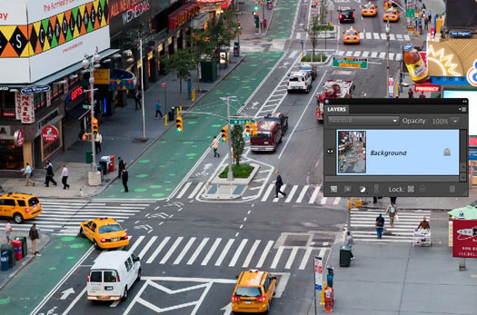
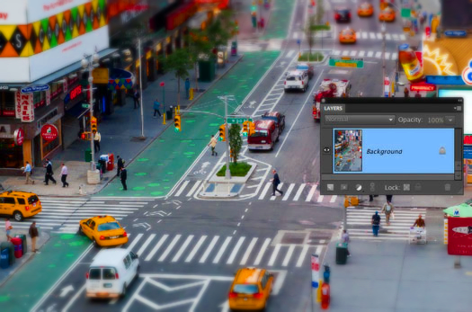

:source-highlighter: pygments
:figure-caption: Figura
:listing-caption: Listagem
:sourcedir: /home/luccas/navamil.github.io/PDI

[.text-justify]

# 7ª Atividade: Ultilizar a tecnica de Tilt-Shift digital em uma imagem

Programa implementado link:tiltshift.cpp[tiltshift.cpp], ultilizando a bilbioteca do OpenCV e o seguinte link:Makefile[Makefile].

OBS: Ao abrir o programa, se os sliders não estiverem presentes, arraste um pouco a tela.

Imagem utilizada, link:crossroad.jpg[crossroad.jpg]:

.Ambiente

Imagem resultado, link:tiltshift.png[tiltshift.png]:

.Resultado

Codigo em C++:

[source, ruby]

[source, cpp]
----
include::{sourcedir}/Tiltshift/tiltshift.cpp[]
----
