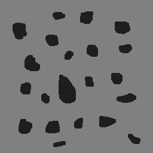

:source-highlighter: pygments
:figure-caption: Figura
:listing-caption: Listagem
:sourcedir: /home/luccas/navamil.github.io/PDI

[.text-justify]

# 3ª Atividade: Identificando bolhas

Programa implementado link:contar.cpp[contar.cpp], ultilizando a bilbioteca do OpenCV e o seguinte link:Makefile[Makefile].

Imagem utilizada, link:bolhas.png[bolhas.png]:

.Bolhas
image::./bolhas.png[256,256]

Imagem resultado, link:contar.png[contar.png]:

.Resultado

Codigo em C++:

[source, ruby]

[source, cpp]
----
include::{sourcedir}/Contarbolha/contar.cpp[]
----
