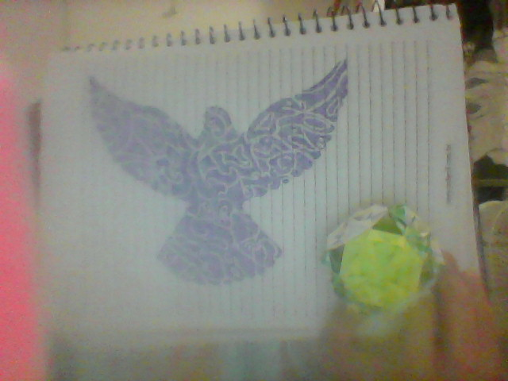
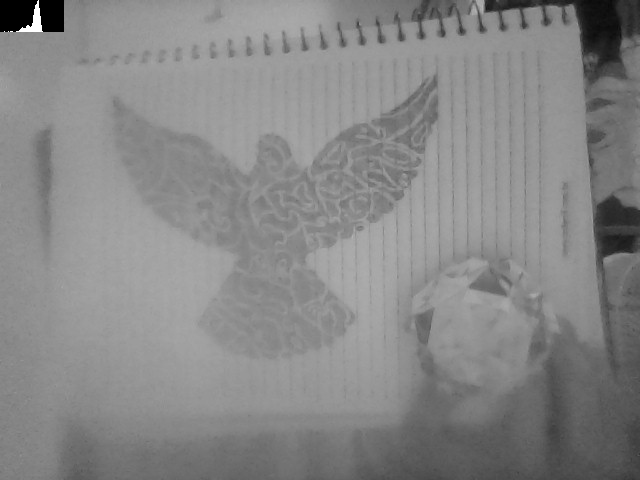
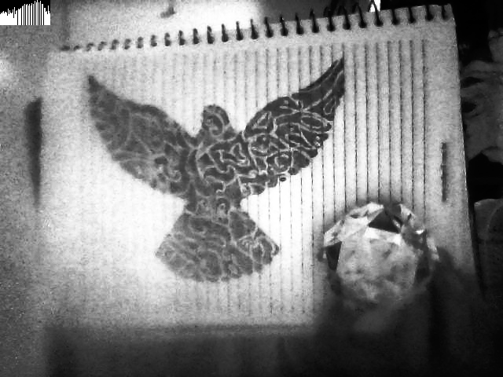

:source-highlighter: pygments
:figure-caption: Figura
:listing-caption: Listagem
:sourcedir: /home/luccas/navamil.github.io/PDI

[.text-justify]

# 4ª Atividade: Equalizar histograma de uma imagem

Programa implementado link:equalize.cpp[equalize.cpp], ultilizando a bilbioteca do OpenCV e o seguinte link:Makefile[Makefile].

Imagem utilizada, link:ambiente.png[ambiente.png]:

.Ambiente

Imagem utilizada em escala cinza e seu respectivo histograma, link:gray.png[gray.png]:

.Imagem em scala cinza

Imagem resultado e seu respectivo histograma, link:equalize.png[equalize.png]:

.Resultado

Codigo em C++:

[source, ruby]

[source, cpp]
----
include::{sourcedir}/Equalize/equalize.cpp[]
----
