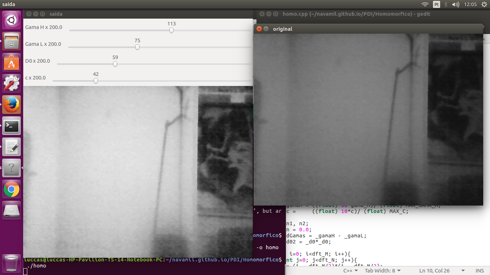

:source-highlighter: pygments
:figure-caption: Figura
:listing-caption: Listagem
:sourcedir: /home/luccas/navamil.github.io/PDI

[.text-justify]

# 1ª Atividade: Ultilizar e aplicar filtro homomorfico em uma imagem

Programa implementado link:homo.cpp[homo.cpp], ultilizando a bilbioteca do OpenCV e o seguinte link:Makefile[Makefile].

Programa em execução:

Ele abre a camera e você ajusta os parametros.

Codigo em C++:

[source, ruby]

[source, cpp]
----
include::{sourcedir}/Homomorfico/homo.cpp[]
----
