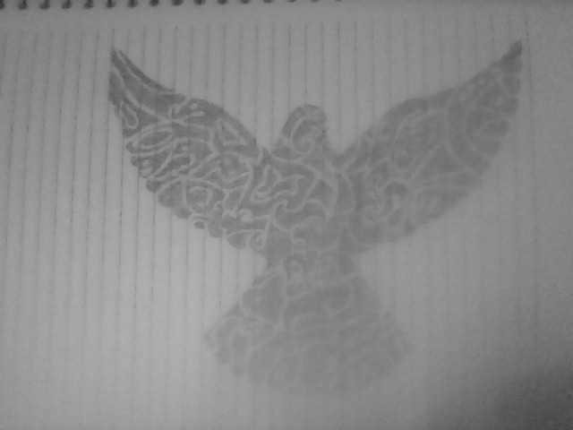
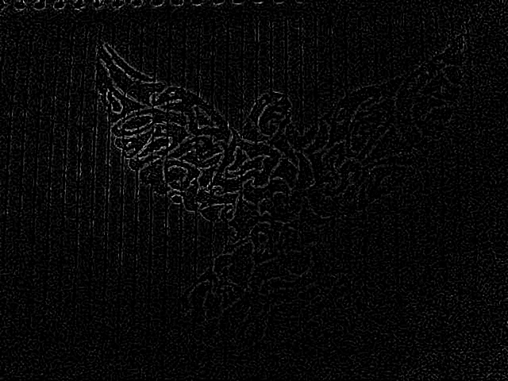

:source-highlighter: pygments
:figure-caption: Figura
:listing-caption: Listagem
:sourcedir: /home/luccas/navamil.github.io/PDI

[.text-justify]

# 6ª Atividade: Aplicando filtro laplaciano-gaussiano

Programa implementado link:laplgauss.cpp[laplgauss.cpp], ultilizando a bilbioteca do OpenCV e o seguinte link:Makefile[Makefile].

Imagem utilizada, link:frame.png[frame.png]:

.Original

Imagem resultado, link:filtrada.png[filtrada.png]:

.Resultado

Codigo em C++:

[source, ruby]

[source, cpp]
----
include::{sourcedir}/Lapgauss/laplgauss.cpp[]
----
