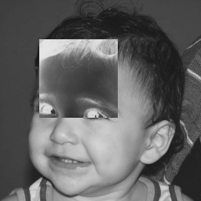

:source-highlighter: pygments
:figure-caption: Figura
:listing-caption: Listagem
:sourcedir: /home/luccas/navamil.github.io/PDI

[.text-justify]

# 1ª Atividade: Negativo de uma região de uma imagem

Programa implementado link:regions.cpp[regions.cpp], ultilizando a bilbioteca do OpenCV e o seguinte link:Makefile[Makefile].

Imagem utilizada, link:biel.png[biel.png]:

.Biel
image::./biel.png[256,256]

Imagem resultado ultilizando os pontos (50,50) e (150,150), link:negativo.png[negativo.png]:

.Negativo

Codigo em C++:

[source, ruby]

[source, cpp]
----
include::{sourcedir}/Regions/regions.cpp[]
----
